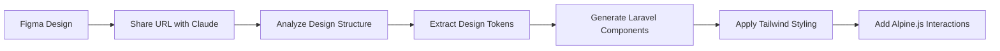

# Laravel Claude Code Setup 🚀

**One-command setup** for Claude Code with Laravel development. Automatically configures all MCP servers for the ultimate AI-powered Laravel development experience with **Figma integration**.

## 🎯 What This Does

Installs and configures Claude Code with a complete development ecosystem:

### 🌐 Global MCP Servers (shared across all projects)
- ✅ **GitHub integration** - Access all your repositories, manage PRs (with automatic token configuration!)
- ✅ **Memory system** - Remember decisions across all projects
- ✅ **Context7** - Latest Laravel/PHP documentation access
- ✅ **Web fetch** - Access external APIs and resources
- ✅ **Figma integration** - Design-to-code workflows with automatic design token extraction

### 📁 Project-Specific MCP Servers
- ✅ **Filesystem access** - Read/write your specific Laravel project files
- ✅ **Database integration** - Direct access to your project's database
- ✅ **Laravel DebugBar** - Real-time debugging (if installed)

### 🎨 **NEW: Figma Design Integration**
- **Design-to-code workflows** - Convert Figma designs directly to Laravel/Livewire components
- **Automatic design token extraction** - Colors, typography, and spacing for Tailwind CSS
- **Component specifications** - Get precise implementation details from Figma designs
- **Seamless integration** - Works with your existing Laravel + Livewire + Filament + Tailwind stack

The installer intelligently sets up global servers once and adds project-specific servers for each Laravel project.

## 🚀 Quick Install

### Option 1: Direct Installation (Recommended)

Run this single command from your Laravel project root:

```bash
curl -fsSL https://raw.githubusercontent.com/laraben/laravel-claude-code-setup/main/install.sh | bash
```

### Option 2: With Tokens Pre-configured

If you want to skip the interactive prompts:

```bash
export GITHUB_TOKEN="your_github_personal_access_token"
export FIGMA_ACCESS_TOKEN="your_figma_access_token"
curl -fsSL https://raw.githubusercontent.com/laraben/laravel-claude-code-setup/main/install.sh | bash
```

### Option 3: Download and Run

For more control or if you prefer to review the script first:

```bash
# Download the script
curl -fsSL https://raw.githubusercontent.com/laraben/laravel-claude-code-setup/main/install.sh -o setup.sh

# Make it executable
chmod +x setup.sh

# Run it
./setup.sh
```

## 📋 Prerequisites

Before running the installer, make sure you have:

1. **Claude Code** installed ([Download here](https://claude.ai/code))
2. **Node.js & npm** installed
3. **Go 1.22+** installed (for database MCP server)
4. **A Laravel project** with `.env` file configured
5. **GitHub Personal Access Token** (the installer will guide you)
6. **Figma Personal Access Token** (optional, for design integration)

## 🔑 Token Setup

### GitHub Token Setup

You'll need a GitHub Personal Access Token for private repository access:

1. Go to [GitHub Settings → Developer settings → Personal access tokens → Tokens (classic)](https://github.com/settings/tokens)
2. Click "Generate new token (classic)"
3. Select these scopes:
   - ✅ `repo` (Full control of private repositories)
   - ✅ `read:user` (Read user profile data)
   - ✅ `user:email` (Access user email addresses)
4. Copy the generated token when prompted by the installer

### 🎨 Figma Token Setup (Optional)

For design-to-code workflows:

1. Go to [Figma Settings → Personal access tokens](https://www.figma.com/settings/account)
2. Click "Create new token"
3. Give it a descriptive name (e.g., "Claude Code MCP")
4. Copy the generated token when prompted by the installer

## 🎮 Usage After Installation

Once installed, just open Claude Code in your Laravel project:

```bash
cd /path/to/your/laravel/project
claude
```

Then test everything works:

### 📊 Database & Project Analysis
- "Show me the database structure"
- "What Laravel version is this project using?"
- "Read my .env file and suggest optimizations"

### 🐙 GitHub Integration
- "List recent commits from my private GitHub repo"
- "Show me open pull requests"
- "What's the current branch status?"

### 🎨 Figma Design Integration
- "Analyze this Figma design: https://www.figma.com/design/ABC123/MyProject"
- "Convert this Figma button component to a Livewire component"
- "Extract the color palette from this Figma file for Tailwind CSS"

### 🧠 Memory & Learning
- "Remember that we use Filament for admin panels"
- "What coding standards do we follow in this project?"
- "What decisions have we made about the authentication system?"

### 🔧 Development Shortcuts
```bash
# Load helpful aliases
source .claude/shortcuts.sh

# Quick commands
pa migrate              # php artisan migrate
make-livewire Button   # php artisan make:livewire Button
serve                  # php artisan serve
```

## 🛠️ What Gets Installed

The script intelligently manages global vs project-specific resources:

### Global MCP Servers (installed once, shared by all projects)
1. **GitHub MCP Server** - Repository access across all projects
2. **Memory MCP Server** - Shared knowledge base
3. **Context7** - Documentation access 
4. **Web Fetch** - External API access
5. **Figma MCP Server** - Design file access and analysis

### Project-Specific MCP Servers (per Laravel project)
1. **Filesystem MCP Server** - Access to your project files
2. **Database MCP Server** - Connected to your project's database
3. **Laravel DebugBar MCP** (if available)

### Project Files (created in `.claude/`)
- **instructions.md** - AI-optimized development instructions with Figma usage guide
- **project_context.md** - Project-specific context and tech stack
- **coding_standards.md** - Laravel/Livewire/Filament best practices
- **memory_prompts.md** - Memory initialization for AI learning
- **shortcuts.sh** - Development aliases and shortcuts
- **README.md** - Setup documentation

### MCP Server Binaries & Dependencies
- **Context7** - Built from source with npm
- **Database MCP** - Built from Go source
- **Web Fetch** - Built from TypeScript source
- **All other servers** - Installed via npm globally

The installer automatically configures everything based on your Laravel `.env` file.

## 🎨 Figma Integration Features

### Design-to-Code Workflow


### Example Figma Commands
```bash
# Analyze a complete design
> Please analyze this Figma design and create the corresponding Laravel views

# Extract design system
> Extract all colors, typography, and spacing from this Figma file for our Tailwind config

# Create specific components
> Convert this Figma card component to a Livewire component with proper validation

# Generate admin interface
> Create a Filament resource based on this Figma admin panel design
```

### Supported Figma Features
- ✅ **Design token extraction** - Colors, typography, spacing
- ✅ **Component analysis** - Buttons, forms, cards, layouts
- ✅ **Layout understanding** - Grid systems, responsive design
- ✅ **Auto-layout interpretation** - Flexbox and grid generation
- ✅ **Style guide creation** - Consistent design system implementation

## 🔧 Advanced Configuration

### Multiple Projects
The installer can be run in multiple Laravel projects. Global MCP servers are shared, while project-specific servers are unique to each project.

### Custom Database Connections
Supports MySQL, PostgreSQL, and SQLite. The installer automatically detects your database configuration from `.env`.

### Team Collaboration
All team members can use the same setup. Share your `.claude/` folder (except sensitive tokens) for consistent AI assistance across the team.

## 🐛 Troubleshooting

### Interactive Mode Not Working?

If you're running via `curl | bash` and the interactive prompts aren't working:

```bash
# Download and run directly for interactive mode
curl -fsSL https://raw.githubusercontent.com/laraben/laravel-claude-code-setup/main/install.sh -o setup.sh
chmod +x setup.sh
./setup.sh
```

### GitHub Private Repository Access Issues?

The installer should configure this automatically. If you still can't access private repos:

1. Check if your token is configured:
```bash
claude mcp list
```

2. Manually update the token in your Claude config:
```bash
# Edit the config file
nano ~/.claude.json

# Add your token to the GitHub MCP server configuration
```

### Figma Integration Not Working?

1. Verify your Figma token is valid
2. Check that the file you're trying to access is not private (unless you have access)
3. Use the full Figma URL format: `https://www.figma.com/design/FILE_KEY/File-Name`

### Database Connection Failed?

Make sure your Laravel `.env` file has valid database credentials before running the installer.

### Missing Dependencies?

The installer will tell you what's missing, but you can check manually:
```bash
# Check Claude Code
claude --version

# Check Node.js
node --version

# Check Go
go version

# Check npm
npm --version
```

## 🆕 What's in v1.0

### 🎨 Figma Integration
- **Complete design-to-code workflow** with Framelink Figma MCP Server
- **Automatic design token extraction** for Tailwind CSS
- **Interactive token management** with proper update prompts
- **Laravel-specific design patterns** and component generation

### 🔧 Enhanced User Experience
- **Improved interactive detection** - Works correctly with `curl | bash`
- **Better token management** - Proper prompts for token updates
- **Graceful error handling** - Continues installation even if some components fail
- **Smart fallbacks** - Multiple installation methods for reliability

### 🧠 AI-Optimized Instructions
- **Figma usage guide** - Detailed instructions for design integration
- **Error handling documentation** - Clear guidance for common issues
- **Laravel-specific workflows** - Optimized for Laravel + Livewire + Filament + Tailwind

### 🛠️ Technical Improvements
- **Robust configuration management** - Better handling of existing setups
- **Cross-platform compatibility** - Enhanced support for different environments
- **Performance optimizations** - Faster installation and startup times

## 🔗 Links & Resources

- **Repository**: [github.com/laraben/laravel-claude-code-setup](https://github.com/laraben/laravel-claude-code-setup)
- **Claude Code**: [claude.ai/code](https://claude.ai/code)
- **Figma MCP Documentation**: [framelink.ai](https://framelink.ai)
- **Laravel Documentation**: [laravel.com/docs](https://laravel.com/docs)

## 🤝 Contributing

Found a bug or want to add a feature? PRs are welcome!

1. Fork the repository
2. Create a feature branch
3. Make your changes
4. Add tests if applicable
5. Submit a pull request

## 📝 License

MIT License - feel free to use this in your projects!

## 🙏 Acknowledgments

- **Claude Code team** for the amazing AI development platform
- **Laravel community** for the incredible framework and ecosystem
- **Figma team** for the design tools and API
- **MCP Server developers** for the various integration tools

---

Made with ❤️ for the Laravel community by [@laraben](https://github.com/laraben)

**Transform your Laravel development with AI-powered assistance! 🚀**
